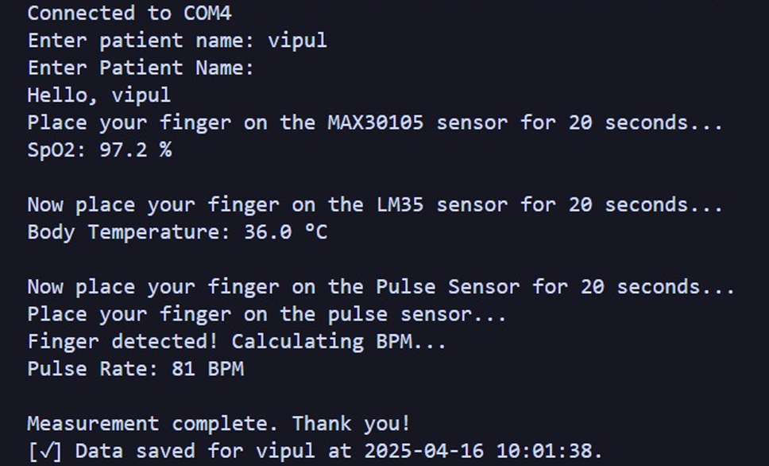

# BioVitals

An integrated health monitoring system using Arduino and sensors to measure pulse rate, SpO₂, and body temperature.

## Components

- Arduino UNO
- MAX30102 (SpO2)
- LM35 (Temperature)
- Heart Pulse Sensor (Heartbeat)

## Circuit Diagram

## Connections

| Component            | Arduino Pin | Sensor Pin/Function |
| -------------------- | ----------- | ------------------- |
| MAX30105 (SpO₂ & IR) | SDA (A4)    | SDA                 |
|                      | SCL (A5)    | SCL                 |
|                      | 3.3V        | VIN                 |
|                      | GND         | GND                 |
| LM35 (Temperature)   | A0          | OUT                 |
|                      | 5V          | VCC                 |
|                      | GND         | GND                 |
| Pulse Sensor         | A1          | Signal              |
|                      | 5V          | VCC                 |
|                      | GND         | GND                 |

## Analytics

